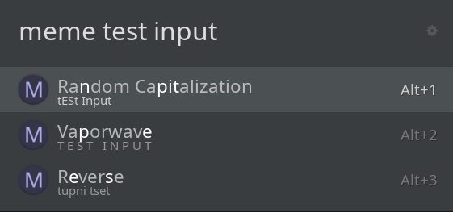
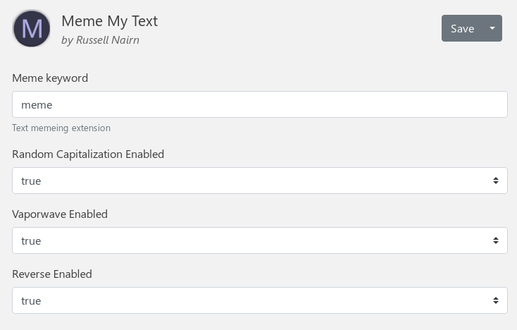

# Ulauncher Meme My Text Extension

The **Meme My Text** Extension is a simple extension for Ulauncher that allows for fast 
altering of text in line with common formats. I made it for myself to avoid having 
to go to some random website any time I wanted to convert text to a meme format 
without the effort of typing it manually.

There's nothing too complicated going on here, but I thought I may as well make it available
should anyone find it useful.

## How to use

Once installed following 
[the instructions from the Ulauncher team](https://ext.ulauncher.io/about)
you can use the extension by bringing up Ulauncher and typing the default keyword 
"meme" followed by the text that you want to modify. A list of options based upon 
the modification types you have enabled will then appear and can be selected in order 
to copy the output to the clipboard.

## Settings

In the extension settings page you can change the default keyword, and you can 
enable/disable any of the text modifications available.

The currently available text modifications are:
- Random Capitalization
- Vaporwave
- Reverse
- Pig Latin

I will be adding more as I feel inclined/as I think of them. You're welcome to give 
suggestions for modifications and I will probably add them if I think they fit.
